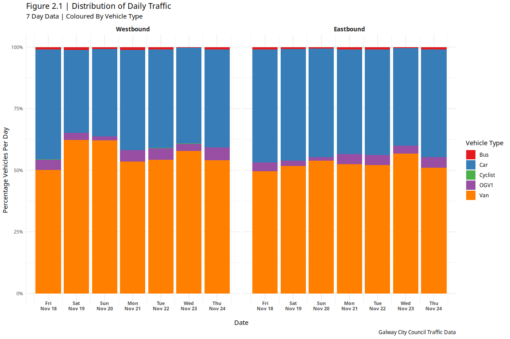

Analysis and Visualisation of Traffic in Galway City
================
Oisin McNally - 14376701
March 26, 2019

### Introduction

Galway City Council have given us some real traffic data on traffic on the N59 just before and at the junction outside the Insight building in the IDA Business park in Dangan. Those of us who work in this area know that this junction suffers severe congestion in the morning and evening.

There are fairly infrequent public transport options on the N59 to and from its nearest town, Moycullen; the road is not terribly bicycle-friendly, as it does not have a bicycle path and is narrow with sharp turns in places. At the same time, Moycullen's population has significantly grown and contributes to the morning and evening commuter traffic.

This report outlines the analysis and visualisation of traffic data supplied by Galway City Council along with suggestions to reduce traffic during peak times and a case for providing a greenway cycle path from Moycullen to Galway city via the IDA Business Park and the University.

### Libraries

``` r
library(ggplot2) # graphs
library(dplyr) # data manipulation
library(tidyr) # data formatting
library(readxl) # excel file handling
library(stringi) # string processing
library(scales) # graph scales
library(ggpubr) # graph layouts
library(ggspectra) # identify graph peaks
```

### Read Data

The format of the original data was not layed out in a way that would easily be imported to R. Each XLSX file contained multiple tables that spread across a number of columns. The data was transposed to populate the rows and additional headers were added to distinguish each table (e.g. Location = Eastbound or Westbound). The data was read into R when it was in an acceptable format.

``` r
traffic_summary <- read.csv('TrafficCounts.csv')
eastbound_detailed <- read_excel('TrafficCounts_Detailed.xlsx', sheet = 1)
westbound_detailed <- read_excel('TrafficCounts_Detailed.xlsx', sheet = 2)
```

### Pre-Processing

The data was further processed to manipulate it into the desired format and data types. Common headers were used across both of the data sets so that data from each file could be compared using visualisations.

``` r
# Pre-Processing
traffic_summary <- traffic_summary %>%
  select(Date:Location) %>%
  na.omit() %>%
  mutate(OGV1 = rowSums(.[6:7])) %>% #OGV1 is both Rigid 2 Axel & Rigid 3 Axle vehicles
  rename(OGV2 = Rigid.4.Axle,
         OGV3 = X3.Axle.HGv,
         OGV4 = X4.Axle.HGV,
         OGV5 = X5.Axle.HGV) %>%
  select(-c(Rigid.2.Axle, Rigid.3.Axle)) %>%
  mutate(Date = as.Date(Date),
         Time = as.character(Time),
         Location = as.character(Location),
         OGV1 = as.integer(OGV1)) %>%
  gather(key = VehicleType, value = Count, -c("Date", "Total", "Time", "Location")) %>%
  rename(TotalVehicles = Total)

stri_sub(eastbound_detailed$Time, 3, 2) <- ":" # separate times with a semi-colon
eastbound_detailed <- eastbound_detailed %>%
  mutate(OGV1 = rowSums(.[34:35]),
         Time = as.POSIXct(strptime(Time, format="%H:%M"))) %>% 
  rename(OGV2 = Rigid.4.Axle,
         OGV3 = X3.Axle.HGv,
         OGV4 = X4.Axle.HGV,
         OGV5 = X5.Axle.HGV) %>%
  select(-c(Rigid.2.Axle, Rigid.3.Axle)) %>%
  gather(key = VehicleType, value = Count, c('Cyclist', 'M.Cycle', 'Car', 
                                             'Van', 'OGV2', 'OGV3', 
                                             'OGV4', 'OGV5', 'Bus', 'OGV1')) %>%
  rename(TotalVehicles = Total)

stri_sub(westbound_detailed$Time, 3, 2) <- ":"
westbound_detailed <- westbound_detailed %>%
  mutate(OGV1 = rowSums(.[34:35]),
         Time = as.POSIXct(strptime(Time, format="%H:%M"))) %>% 
  rename(OGV2 = Rigid.4.Axle,
         OGV3 = X3.Axle.HGv,
         OGV4 = X4.Axle.HGV,
         OGV5 = X5.Axle.HGV) %>%
  select(-c(Rigid.2.Axle, Rigid.3.Axle)) %>%
  gather(key = VehicleType, value = Count, c('Cyclist', 'M.Cycle', 'Car', 
                                           'Van', 'OGV2', 'OGV3', 
                                           'OGV4', 'OGV5', 'Bus', 'OGV1')) %>%
  rename(TotalVehicles = Total)
```

1. The Periods Of Traffic Congestion
------------------------------------

### Processing

Vehicles with low counts were filtered from the data to reduce the amount of objects on the graph that cause clutter and do little to add meaning to the traffic in periods of congestion.

The data was grouped by the time and type of vehicle to calculate an average value for each vehicle at specific times of the day.

A line graph colored by the type of vehicle was used as it is easy to follow for time-series data. Peaks were calculated to highlight the periods of peak congestion for westbound and eastbound traffic.

``` r
# the periods of traffic congestion
westbound_congestion <- westbound_detailed %>%
  filter(VehicleType == "Bus" | VehicleType == "Van" | VehicleType == "Cyclist" |
           VehicleType == "Car" | VehicleType == "OGV1") %>%
  group_by(Time, VehicleType) %>%
  summarise(Average = sum(Count) / 7) # sum vehicle counts and divide by 7 for average

eastbound_congestion <- eastbound_detailed %>%
  filter(VehicleType == "Bus" | VehicleType == "Van" | VehicleType == "Cyclist" |
           VehicleType == "Car" | VehicleType == "OGV1") %>%
  group_by(Time, VehicleType) %>%
  summarise(Average = sum(Count) / 7)

f1.1 <- ggplot(westbound_congestion, aes(x = Time, y = Average)) +
  geom_line(aes(color = VehicleType)) +
  scale_x_datetime(breaks = date_breaks("2 hour"), labels = date_format("%H:%M")) +
  labs(title = "Figure 1.1 | Westbound Traffic - Periods of Congestion",
       subtitle = "7 Day Data | Coloured By Vehicle Type",
       color = "Vehicle Type") +
  ylab("Average Number Vehicles") +
  stat_peaks(span = 101, shape = 21, size = 1.5, color = "black", fill = "white", stroke = 1) + # label peaks in traffic
  theme_linedraw() +
  scale_color_brewer(palette = "Set1")

f1.2 <- ggplot(eastbound_congestion, aes(x = Time, y = Average)) +
  geom_line(aes(color = VehicleType)) +
  scale_x_datetime(breaks = date_breaks("2 hour"), labels = date_format("%H:%M")) +
  labs(title = "Figure 1.2 | Eastbound Traffic - Periods of Congestion",
       subtitle = "7 Day Data | Coloured By Vehicle Type",
       color = "Vehicle Type",
       caption = "Galway City Council Traffic Data") +
  ylab("Average Number Vehicles") +
  stat_peaks(span = 101, shape = 21, size = 1.5, color = "black", fill = "white", stroke = 1) +
  theme_linedraw() +
  scale_color_brewer(palette = "Set1")
```

### Analysis

By observing the shape of the graph we can get a sense of the period of congestion. For both westbound and eastbound traffic there is a sharp increase in average number of vehicles from approximately 5:00 to 8:00/8:30.

This is due to the early morning commuter traffic where large amounts of people are on their way to work. The majority of these vehicles are cars and vans and there is also an interestingly low number of cyclists.

The congestion reduces slightly after this period during the common working hours. The congestion seems to then increase relatively steady again during the hours of 10:00 to 16:00. This could be due to people travelling for lunch breaks or due to school runs which would cause large numbers of vehicles to return to the road.

The next peak in congestion occurs around 17:00/18:00 when people finish work and return home. This congestion then steadily declines after the common working hours.

``` r
ggarrange(f1.1, f1.2, ncol = 1, nrow = 2, common.legend = T, legend = "right")
```


2. Vehicle Distribution Of Daily Traffic
----------------------------------------

### Processing

Vehicles with low counts were filtered from the data.

``` r
total_traffic <- traffic_summary %>%
  mutate(Location = factor(Location, levels = c("Westbound", "Eastbound"))) %>%
  filter(VehicleType == "Bus" | VehicleType == "Van" | VehicleType == "Cyclist" |
          VehicleType == "Car" | VehicleType == "OGV1")
```

### Analysis

A scaled bar chart was used to show the distributions of vehicle types contributing to the westbound and eastbound traffic over a 7 day period.

It is clear that most of the traffic is dominated by vans and cars which would be expected. A small portion of the traffic consists of small goods vehicles (OGV1) and buses. Once again a surprisingly small number of cyclists contribute to the daily traffic as the number is so small that the category is not even visible on the graph.

``` r
ggplot(total_traffic, aes(x = Date, y = Count, fill = VehicleType)) +
  geom_col(position = "fill", width = 0.9) +
  scale_y_continuous(labels = scales::percent) +
  scale_x_date(breaks = date_breaks("1 day"), labels = date_format("%a\n%b %d")) +
  facet_grid(~Location) +
  labs(title = "Figure 2.1 | Distribution of Daily Traffic",
       subtitle = "7 Day Data | Coloured By Vehicle Type",
       fill = "Vehicle Type",
       caption = "Galway City Council Traffic Data") +
  ylab("Percentage Vehicles Per Day") +
  theme_minimal() +
  theme(axis.text.x = element_text(vjust = 5, size=8, face="bold"),
        strip.text.x = element_text(size = 10, face = "bold"),
        axis.line.y= element_line(colour = "grey", size = 0.1),
        axis.text.y = element_text(size=8)) +
  scale_fill_brewer(palette = "Set1")
```



3. Galway City Council Recommendations
--------------------------------------

### Processing

The turning data was filtered to only show vehicles turning from and turning into the N59 towards north western townland areas. The total number of vehicles was calculated for each route and the distribution of vehicles was calculated for each time of day.

An area chart was used to show the quantity of vehicles occupying each route while a scaled area chart was used to show the distribution of vehicles across the time of day.

``` r
turning <- read.csv('TurningCounts.csv')


eastbound_turning <- turning %>%
  filter(Route == "B => A" | Route == "B => D" | Route == "B => C") %>%
  mutate(Bus = rowSums(.[9:11]),
         Time = as.POSIXct(strptime(TIME, format="%H:%M"))) %>%
  select(-c("TIME", "PCU", "TOT", "CDB", "BEB", "OB")) %>%
  gather(key = VehicleType, value = Count, -c("Route", "Time")) %>%
  filter(VehicleType == "Bus" | VehicleType == "Van" | VehicleType == "Cyclist" |
           VehicleType == "Car" | VehicleType == "OGV1") %>%
  group_by(Time, Route) %>%
  summarise(TotalVehicles = sum(Count))

# reorder factors levels in route based on values in TotalVehicles from smallest to largest
# required to have smallest area chart at the "front"
eastbound_turning$Route <- reorder(eastbound_turning$Route, eastbound_turning$TotalVehicles, function(x) -max(x) )


f3.1 <- ggplot(eastbound_turning, aes(x = Time, y = TotalVehicles, fill = Route)) +
  geom_area(position = "identity", color = "black", size = 0.3) +
  scale_x_datetime(breaks = date_breaks("2 hour"), labels = date_format("%H:%M")) +
  labs(title = "Figure 3.1 | Traffic Counts Turning from N59 ",
       subtitle = "22nd November 2016",
       fill = "Destination") +
  ylab("Vehicle Count") +
  theme_minimal() +
  scale_fill_brewer(palette = "Set2",
                    labels = c("Northern Campus/City",
                               "Central Campus/City",
                               "IDA Business Park"))

eastbound_turning_distribution <- turning %>%
  filter(Route == "B => A" | Route == "B => D" | Route == "B => C") %>%
  mutate(Bus = rowSums(.[9:11]),
         Time = as.POSIXct(strptime(TIME, format="%H:%M"))) %>%
  select(-c("TIME", "PCU", "TOT", "CDB", "BEB", "OB")) %>%
  gather(key = VehicleType, value = Count, -c("Route", "Time")) %>%
  filter(VehicleType == "Bus" | VehicleType == "Van" | VehicleType == "Cyclist" |
           VehicleType == "Car" | VehicleType == "OGV1") %>%
  group_by(Time, VehicleType) %>%
  summarise(TotalVehicles = sum(Count))

f3.2 <- ggplot(eastbound_turning_distribution, aes(x = Time, y = TotalVehicles, fill = VehicleType)) +
  geom_area(position = "fill", color = "black", size = 0.3) +
  scale_y_continuous(labels = scales::percent) +
  scale_x_datetime(breaks = date_breaks("2 hour"), labels = date_format("%H:%M")) +
  labs(title = "Figure 3.2 | Distribution Of Traffic Turning from N59",
       subtitle = "22nd November 2016",
       fill = "Vehicle Type",
       caption = "Galway City Council Traffic Data") +
  ylab("Percentage Vehicles") +
  theme_minimal() +
  scale_fill_brewer(palette = "Set1")

westbound_turning <- turning %>%
  filter(Route == "A => B" | Route == "D => B" | Route == "C => B") %>%
  mutate(Bus = rowSums(.[9:11]),
         Time = as.POSIXct(strptime(TIME, format="%H:%M"))) %>%
  select(-c("TIME", "PCU", "TOT", "CDB", "BEB", "OB")) %>%
  gather(key = VehicleType, value = Count, -c("Route", "Time")) %>%
  filter(VehicleType == "Bus" | VehicleType == "Van" | VehicleType == "Cyclist" |
           VehicleType == "Car" | VehicleType == "OGV1") %>%
  group_by(Time, Route) %>%
  summarise(TotalVehicles = sum(Count))

westbound_turning$Route <- reorder(westbound_turning$Route, westbound_turning$TotalVehicles, function(x) -max(x) )

f3.3 <- ggplot(westbound_turning, aes(x = Time, y = TotalVehicles, fill = Route)) +
  geom_area(position = "identity", color = "black", size = 0.3) +
  scale_x_datetime(breaks = date_breaks("2 hour"), labels = date_format("%H:%M")) +
  labs(title = "Figure 3.3 | Traffic Counts Turning To N59",
       subtitle = "22nd November 2016",
       fill = "Origin") +
  ylab("Vehicle Count") +
  theme_minimal() +
  scale_fill_brewer(palette = "Set2",
                     labels = c("Central Campus/City",
                                "Northern Campus/City",
                                "IDA Business Park"))

westbound_turning_distribution <- turning %>%
  filter(Route == "A => B" | Route == "D => B" | Route == "C => B") %>%
  mutate(Bus = rowSums(.[9:11]),
         Time = as.POSIXct(strptime(TIME, format="%H:%M"))) %>%
  select(-c("TIME", "PCU", "TOT", "CDB", "BEB", "OB")) %>%
  gather(key = VehicleType, value = Count, -c("Route", "Time")) %>%
  filter(VehicleType == "Bus" | VehicleType == "Van" | VehicleType == "Cyclist" |
           VehicleType == "Car" | VehicleType == "OGV1") %>%
  group_by(Time, VehicleType) %>%
  summarise(TotalVehicles = sum(Count))


f3.4 <- ggplot(westbound_turning_distribution, aes(x = Time, y = TotalVehicles, fill = VehicleType)) +
  geom_area(position = "fill", color = "black", size = 0.3) +
  scale_y_continuous(labels = scales::percent) +
  scale_x_datetime(breaks = date_breaks("2 hour"), labels = date_format("%H:%M")) +
  labs(title = "Figure 3.4 | Distribution Of Traffic Turning to N59",
       subtitle = "22nd November 2016",
       fill = "Vehicle Type",
       caption = "Galway City Council Traffic Data") +
  ylab("Percentage Vehicles") +
  theme_minimal() +
  scale_fill_brewer(palette = "Set1")
```

### Traffic Analysis Travelling From N59

Most of the traffic coming from the N59 is in the morning hours approximately between 7:00 and 10:00. The traffic then remains mostly consistent throughout the day.

An important observation is that there is no peak during the evening hours. This would suggest that the traffic peak in the morning is a result of people commuting from the N59.

The majority of the vehicles consists of cars while there is a smaller proportion of OGV1, vans and cyclists. The amount of buses contributing to vehicle distribution is very small. The distribution of vehicles does not drastically change throughout the day.

``` r
ggarrange(f3.1, f3.2, ncol = 1, nrow = 2, common.legend = F, legend = "top")
```


### Discussion

-   Majority of vehicles are cars/vans so reducing the number of these would help to alleviate traffic.
-   A bus takes approximately 40 cars off the road\[1\]. In our case each bus reduces the vehicle count for a single route by 40.
-   At 8:30, 8:45 and 9:00 approximately 25 people turn into the IDA Business Park, a total of 75 vehicles.
-   The travel time from Moycullen to IDA Business Park & NUIG entrance (University Rd) is approximately 15 mins by car without traffic\[2\].
-   Figure 3.1 shows an approximate two-fold increase in traffic numbers during the morning so we could estimate the journey would take twice as long (30 mins).
-   Therefore a bus service leaving Moycullen at 8:00 and 8:30 would reduce the number of vehicles arriving into the IDA Business Park at 8:30 and 9:00.
-   Since each bus reduces the number of vehicles by approximately 40, this should be more than adequate to reduce the 75 vehicles arriving into the IDA Business Park between 8:30 - 9:00
-   The number of vehicles arriving to the other routes starts to peak at an earlier time of 7:30 and continues to be elevated until 9:00.
-   Considering an average travel time of 30 mins, a bus every 30 mins from 7:00 until 9:00 for each route would help to reduce the elevated number of vehicles arriving at these junctions to the levels seen throughout the remainder of the day.

### Traffic Analysis Travelling To N59

A similar pattern can be seen for the traffic turning into the N59. The peak of this congestion is during the evening hours as commuters return home from the city.

There is a large number of OGV1 vehicles in the morning, possibly due to deliveries from the city to surrounding townland and Gaeltacht areas but this does not contribute to the traffic congestion.

The distribution of vehicles is similar to the distribution of vehicles seen turning from the N59. This could suggest that this distribution would be approximate of the overall traffic distribution in this area.

Figure 3.3 shares the same characteristics as Figure 3.1, however the peak congestion is skewed to the evening hours. Therefore by using similar concepts to the ideas discussed earlier, we should be able to alleviate the evening traffic in a similar way.

``` r
ggarrange(f3.3, f3.4, ncol = 1, nrow = 2, common.legend = F, legend = "top")
```


### Discussion

-   The traffic begins to peak from each direction around 16:00 until it begins to decrease sharply at 18:00.
-   A bus every 30 minutes between 16:00 and 18:00 would reduce the number of vehicles present at Central Campus/City and Northern Campus/City junctions at these times to levels seen throughout the non-peak hours of the day.
-   The traffic at the IDA Business Park junction is much less significant so a single bus at 17:30 should would be sufficient to reduce the peak in congestion for this route between the times of 17:00 and 18:00.

Recommendations
---------------

-   Two buses depart Moycullen at approx 7:00, 7:30 and 9:00.
-   Three buses depart Moycullen at approx 8:00 and 8:30.
-   Two buses depart the city and pickup at NUIG & IDA Business Park at approx 16:00, 16:30, 17:00 and 18:00.
-   Three buses depart the city and pickup at NUIG & IDA Business Park at approx 17:30.

Bike Lane Discussion
--------------------

Another case to consider is providing a greenway cycle path from Moycullen to Galway city via the IDA Business Park and the University.

Considering that the volume of traffic travelling to and from the IDA Business Park via the N59 is not that significant, the introduction of a bicycle lane could be an option. This would remove the need for the additional buses used to alleviate the congestion on this route.

There already seems to be about 20% or 25% of the traffic distribution on the N59 route composed of cyclists indicating that a significant number of people are willing to cycle.

The introduction of a cycle lane should help to promote an increase in the volume of cyclists and improve the road safety for the significant percentage of people that cycle on this route already.

References
----------

\[1\] Bic.asn.au. (2019). Climate Change and Public Transport. \[online\] Available at: <http://bic.asn.au/information-for-moving-people/climate-change-and-public-transport> \[Accessed 26 Mar. 2019\].

\[2\] Google Maps. (2019). Moycullen to National University of Ireland Galway. \[online\] Available at: <https://goo.gl/KFA6CD> \[Accessed 26 Mar. 2019\].
